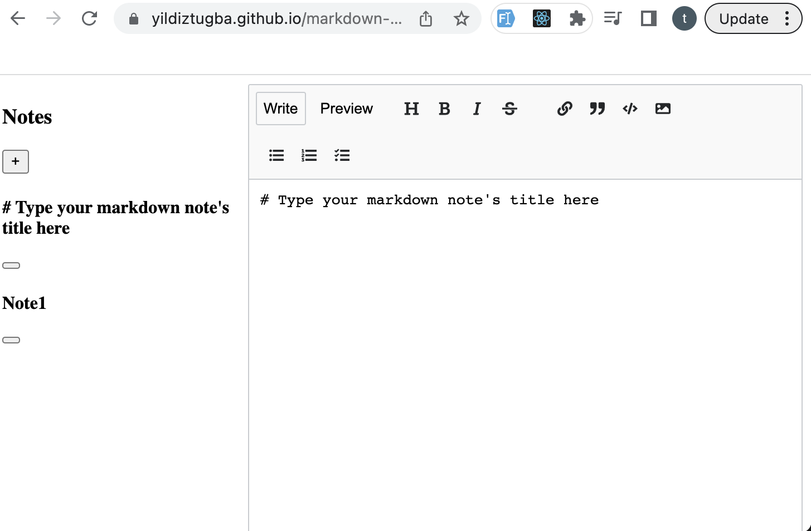

# React Project

## Markdown Notes App

I developed this project after I completed Section 4 of React course on Scrimba.

The aim is to add new features to the current app.

The current app has a list of notes on the left. You can create a new note by clicking the button. On the right it has a markdown editor which you can switch between write and preview mode.   

Futures to add:
-   Sync notes with localStorage
-   Add note summary titles
-   Move modified notes to the top of the list
-   Delete notes
---

Link:
[http://yildiztugba.github.io/markdown-notes-app](http://yildiztugba.github.io/markdown-notes-app)

## Overview


## Tools and Technologies

- React
  - State, setState
  - UseEffect
  - props
  - LocalStorage.getItem, LocalStorage.setItem
  - JSON.stringify, JSON.parse 
  - map, filter, split, unshift, push
  - lazy state initialization
  - declarative methods
  - call parent methods
  - event.stopPropagation()
  

### Devops

- Github

## Setup

To run the app, type `npm start` in the CLI.

## Sample React code

Here is a look at the side effect to run every time the note array changes. Array changes to the string, then it is saved to LocalStorage.

```
 React.useEffect(()=>{
      localStorage.setItem("notes", JSON.stringify(notes))
    },[notes])

```